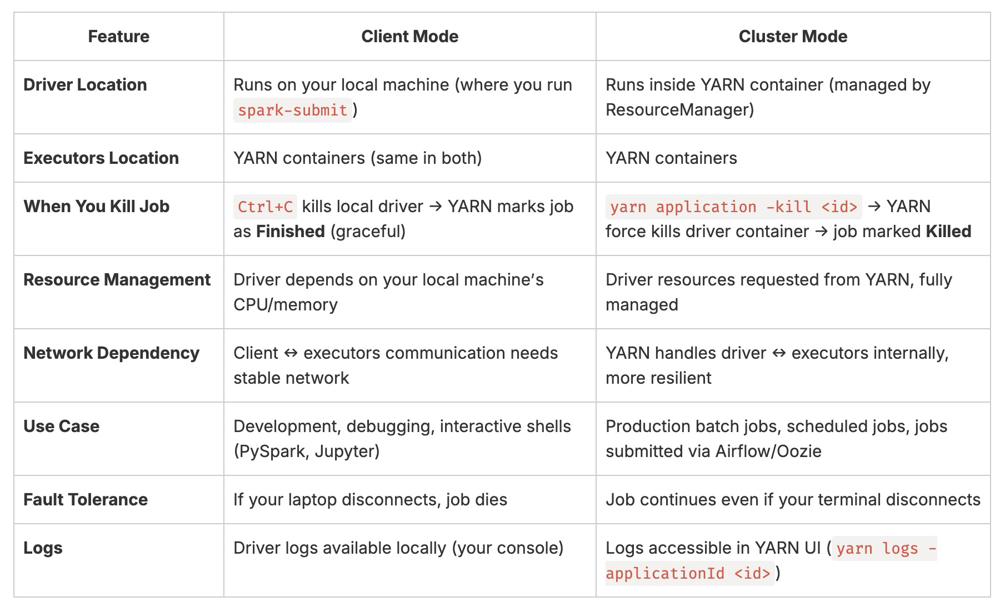

#### Day18: Run Spark on YARN / standalone cluster
---

#### Install Hadoop (includes YARN)
- First, make sure you have Java installed:

``` bash
java -version
```
**Install Using Homebrew (easiest)**
``` bash
brew install hadoop
``` 
-  Configure Hadoop/YARN
/opt/homebrew/Cellar/hadoop/3.4.1/libexec/etc/hadoop/

**core-site.xml**
``` xml
<configuration>
    <property>
        <name>fs.defaultFS</name>
        <value>hdfs://localhost:9000</value>
    </property>
</configuration>
```
**yarn-site.xml**
``` xml
<configuration>
    <property>
        <name>yarn.nodemanager.aux-services</name>
        <value>mapreduce_shuffle</value>
    </property>
    <property>
        <name>yarn.resourcemanager.hostname</name>
        <value>localhost</value>
    </property>
</configuration>
```
- Setting Hadoop Home path at ~/.zshrc
``` bash
export HADOOP_HOME="/opt/homebrew/Cellar/hadoop/3.4.1/libexec"
export PATH=$PATH:$HADOOP_HOME/bin:$HADOOP_HOME/sbin
export HADOOP_CONF_DIR=$HADOOP_HOME/etc/hadoop
```
**Install Apache Spark**
``` bash
brew install apache-spark
# in my case, have already installed it
```
**Start the services**
``` bash
# Format namenode (first time only)
hdfs namenode -format

# Create these soft links under /opt/homebrew/bin/
cd /opt/homebrew/bin/
ln -s ../Cellar/hadoop/3.4.1/sbin/start-dfs.sh start-dfs.sh
ln -s ../Cellar/hadoop/3.4.1/sbin/start-yarn.sh start-yarn.sh

# Start Hadoop services
start-dfs.sh
start-yarn.sh

# Verify YARN is running
yarn node -list

```
- Start Spark shell with YARN:
``` bash
spark-shell --master yarn --deploy-mode client
```
- Check running applications:
``` bash
yarn application -list
```

**Running Spark in Standalone Mode:-**

_Submit Job:_
``` bash
spark-submit --master "local[4]" wordcount.py
```

**Running Spark on YARN:-**

**Syntax:**
``` bash
spark-submit \
  --master yarn \
  --deploy-mode client \
  /path/to/your_app.py
```
**Execution:**
``` bash
spark-submit \
  --master yarn \
  --deploy-mode client \
spark.py

# or 

spark-submit --master yarn --deploy-mode client wordcount.py
```
- Incase you have python version miss-match use below method:
``` bash
PYSPARK_PYTHON=$(which python3) \
PYSPARK_DRIVER_PYTHON=$(which python3) \
spark-submit --master yarn --deploy-mode client wordcount.py
```
**Check on UI:**

- YARN ResourceManager UI → http://localhost:8088

**YARN Cluster Mode**
``` bash
PYSPARK_PYTHON=$(which python3) \
PYSPARK_DRIVER_PYTHON=$(which python3) \
spark-submit --master yarn --deploy-mode cluster wordcount.py
```
**Verification:**
``` bash
yarn node -list 

# check on Number-of-Running-Containers

yarn application -list

# To kill the application
yarn application -kill application_12345
```
**Stop Services:**
``` bash
stop-yarn.sh
stop-dfs.sh
```

Here’s a clear comparison of Client vs Cluster Mode in Spark on YARN:

