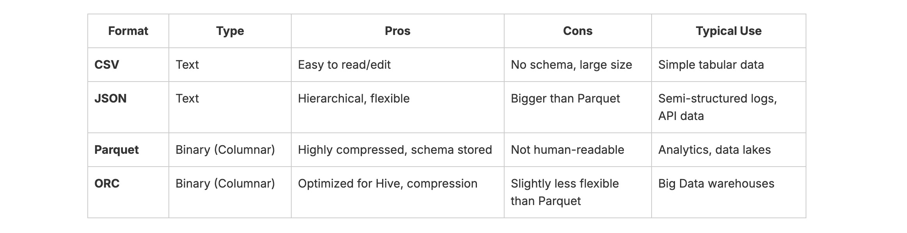
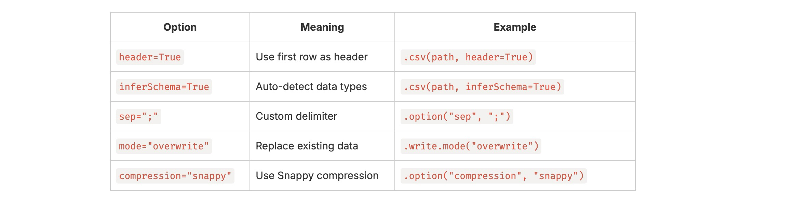

#### Day22: Work with File Formats (CSV, JSON, Parquet, ORC)
---

In real projects, Spark rarely works with in-memory data only; it mostly reads/writes data from files in various formats.

Here are the abbreviations:
- CSV - Comma-Separated Values
- JSON - JavaScript Object Notation
- ORC - Optimised Row Columnar
- Parquet - Not an abbreviation; Parquet is a columnar storage file format optimised for analytical queries in data warehouses, offering efficient compression and fast read performance for big data processing.

#### 1. Overview of Common File Formats


#### 2. Key Differences — Row vs Column Formats


Columnar formats store values column by column, so Spark can scan only needed columns → massive speed-ups.

#### 3. Spark’s Unified API for Files

Spark lets you read and write any of these formats using the same simple pattern:

``` python
spark.read.format("<format>").options(...).load("<path>")
df.write.format("<format>").options(...).save("<path>")

```
You can also use shortcut methods: .csv(), .json(), .parquet(), .orc().

#### 4. Practical PySpark Examples
Let’s go through examples for each file type 👇

**4.1 Read CSV**
``` python
from pyspark.sql import SparkSession

spark = SparkSession.builder.appName("ReadCSVExample").getOrCreate()

# Read CSV
df_csv = spark.read.csv("file:///Users/sureshkumar/myspark/week4/file-formats/data/employees.csv", header=True, inferSchema=True)
df_csv.show(5)
df_csv.printSchema()

# Write back as CSV
df_csv.write.mode("overwrite").csv("file:///Users/sureshkumar/myspark/week4/file-formats/output/employees_csv")


```
- Make output & data paths are available

**4.2 Read JSON**
``` python
from pyspark.sql import SparkSession

spark = SparkSession.builder.appName("ReadCSVExample").getOrCreate()

#Read JSON
df_json = spark.read.json("file:///Users/sureshkumar/myspark/week4/file-formats/data/employees.json")
df_json.show(5)
df_json.printSchema()

# Write as JSON
df_json.write.mode("overwrite").json("file:///Users/sureshkumar/myspark/week4/file-formats/output/employees_json")
```
- Note: Each JSON object should be on its own line, like this:
``` bash
{"employee_id": 101, "first_name": "John", "last_name": "Doe", "department_id": 10, "salary": 5000}
{"employee_id": 102, "first_name": "Jane", "last_name": "Smith", "department_id": 20, "salary": 6000}
{"employee_id": 103, "first_name": "Robert", "last_name": "Brown", "department_id": 10, "salary": 5500}
{"employee_id": 104, "first_name": "Emily", "last_name": "Johnson", "department_id": 30, "salary": 6500}
{"employee_id": 105, "first_name": "Michael", "last_name": "Lee", "department_id": 20, "salary": 6200}
```
#### 4.3 Read Parquet

We need to create a parquet file in first place.

Create _employees.parquet_ with this code:
``` python
from pyspark.sql import SparkSession
from pyspark.sql import Row

spark = SparkSession.builder.appName("ManualParquetCreate").getOrCreate()

data = [
    Row(employee_id=101, first_name="John", last_name="Doe", department_id=10, salary=5000),
    Row(employee_id=102, first_name="Jane", last_name="Smith", department_id=20, salary=6000),
    Row(employee_id=103, first_name="Robert", last_name="Brown", department_id=10, salary=5500),
    Row(employee_id=104, first_name="Emily", last_name="Johnson", department_id=30, salary=6500),
    Row(employee_id=105, first_name="Michael", last_name="Lee", department_id=20, salary=6200)
]

df = spark.createDataFrame(data)

df.show()

# Save as Parquet
df.write.mode("overwrite").parquet("file:///Users/sureshkumar/myspark/week4/file-formats/data/employees.parquet")
```
**Now Read :**
``` python
from pyspark.sql import SparkSession

spark = SparkSession.builder.appName("ReadParquetExample").getOrCreate()

df_parquet = spark.read.parquet("file:///Users/sureshkumar/myspark/week4/file-formats/data/employees.parquet")
df_parquet.show(3)
df_parquet.printSchema()

# Write as Parquet (very efficient)
df_parquet.write.mode("overwrite").parquet("file:///Users/sureshkumar/myspark/week4/file-formats/output/employees_parquet")
```
- ✅ Parquet automatically keeps schema and data types, so it loads much faster.
#### 4.4 Read ORC
**Create ORC file:**
``` python
from pyspark.sql import SparkSession
from pyspark.sql import Row

spark = SparkSession.builder.appName("ManualORCCreate").getOrCreate()

data = [
    Row(employee_id=101, first_name="John", last_name="Doe", department_id=10, salary=5000),
    Row(employee_id=102, first_name="Jane", last_name="Smith", department_id=20, salary=6000),
    Row(employee_id=103, first_name="Robert", last_name="Brown", department_id=10, salary=5500),
    Row(employee_id=104, first_name="Emily", last_name="Johnson", department_id=30, salary=6500),
    Row(employee_id=105, first_name="Michael", last_name="Lee", department_id=20, salary=6200)
]

df = spark.createDataFrame(data)

df.show()

# Save as ORC
df.write.mode("overwrite").orc("file:///Users/sureshkumar/myspark/week4/file-formats/data/employees.orc")
```
**Read ORC file:**
``` python
from pyspark.sql import SparkSession

spark = SparkSession.builder.appName("ReadORCExample").getOrCreate()

df_orc = spark.read.orc("file:///Users/sureshkumar/myspark/week4/file-formats/data/employees.orc")
df_orc.show(5)
df_orc.printSchema()

# Write as ORC
df_orc.write.mode("overwrite").orc("file:///Users/sureshkumar/myspark/week4/file-formats/output/employees_orc")

```

#### 5. Compare Performance (Small Test)

``` python
from pyspark.sql import SparkSession
import time

spark = SparkSession.builder.appName("SmallTest").getOrCreate()

start = time.time()
spark.read.csv("file:///Users/sureshkumar/myspark/week4/file-formats/data/employees.csv", header=True, inferSchema=True).count()
print("CSV Read Time:", round(time.time()-start, 2), "s")

start = time.time()
spark.read.parquet("file:///Users/sureshkumar/myspark/week4/file-formats/data/employees.parquet").count()
print("Parquet Read Time:", round(time.time()-start, 2), "s")

spark.stop()
```
- Notice: Parquet is much faster because it reads fewer bytes and only needed columns.

#### 6. Common Options


#### 🎯 Exercises :
**Convert CSV → Parquet :**
``` python
from pyspark.sql import SparkSession

spark = SparkSession.builder.appName("FileFormatsExample").getOrCreate()

# Read CSV
df_csv = spark.read.csv("file:///Users/sureshkumar/myspark/week4/file-formats/data/employees.csv", header=True, inferSchema=True)

df_csv.write.mode("overwrite").parquet("file:///Users/sureshkumar/myspark/week4/file-formats/output/employees_parquet")

print(f"✅ CSV converted to Parquet successfully.")
```
**Compare Read Performance :**
``` python
from pyspark.sql import SparkSession
import time

spark = SparkSession.builder.appName("FileFormatReadTimeComparison").getOrCreate()

# --- CSV ---
start = time.time()
spark.read.csv(
    "file:///Users/sureshkumar/myspark/week4/file-formats/data/employees.csv",
    header=True,
    inferSchema=True
).count()
print("CSV Read Time:", round(time.time() - start, 2), "s")

# --- Parquet ---
start = time.time()
spark.read.parquet(
    "file:///Users/sureshkumar/myspark/week4/file-formats/data/employees.parquet"
).count()
print("Parquet Read Time:", round(time.time() - start, 2), "s")

# --- JSON ---
start = time.time()
spark.read.json(
    "file:///Users/sureshkumar/myspark/week4/file-formats/data/employees.json"
).count()
print("JSON Read Time:", round(time.time() - start, 2), "s")

# --- ORC ---
start = time.time()
spark.read.orc(
    "file:///Users/sureshkumar/myspark/week4/file-formats/data/employees.orc"
).count()
print("ORC Read Time:", round(time.time() - start, 2), "s")

spark.stop()
```
**Output:**
``` bash
CSV Read Time: 2.03 s
Parquet Read Time: 0.29 s
JSON Read Time: 0.11 s
ORC Read Time: 0.6 s
```
#### ✅ Summary

#### 💡 Tips & Tricks
**1️⃣ Always Use** _inferSchema=True_ or _Define Schema_
- CSV & JSON don’t store data types.
- Without a schema, all columns are read as strings → harder to filter/aggregate.

**Example:**
``` python
df = spark.read.csv("data.csv", header=True, inferSchema=True)
```
**2️⃣ Use mode to Handle Bad Records**
- mode="PERMISSIVE" → default, sets bad records to null
- mode="DROPMALFORMED" → drops corrupt rows
- mode="FAILFAST" → stops job on bad record
``` python
spark.read.option("mode", "DROPMALFORMED").csv("data.csv")
```
**3️⃣ Columnar Formats are Faster for Analytics**
- Parquet/ORC = compressed + columnar → faster scans.
- Always prefer Parquet for big data, especially if queries read only a few columns.

**4️⃣ Use Compression for Storage Savings**
- Parquet/ORC support snappy, gzip, zlib, etc.
``` python
df.write.option("compression", "snappy").parquet("output/employees_parquet")
```
**5️⃣ Avoid Repeated Reads/Writes**
- Instead of reading CSV multiple times, read once → cache() → write in multiple formats.
``` python
df = spark.read.csv("data.csv", header=True, inferSchema=True).cache()
df.write.parquet("output.parquet")
df.write.json("output.json")
```
**6️⃣ JSON is Flexible but Slow**
- JSON allows nested data → great for semi-structured logs
- But slower to read/write than Parquet → use Parquet for analytics pipelines.

**7️⃣ ORC is Optimized for Hive**
- If your Spark job writes to Hive tables → use ORC.
- Best compression, predicate pushdown, fast queries in Hive/Spark.