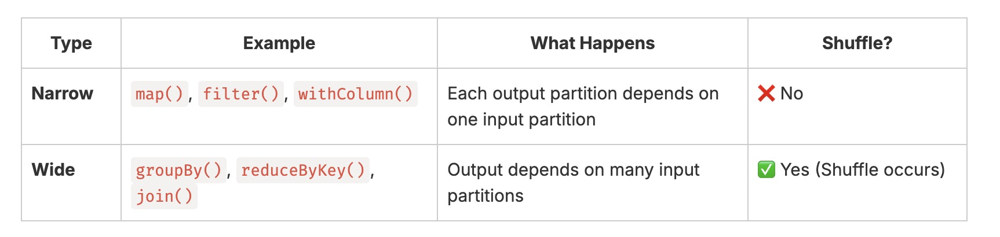
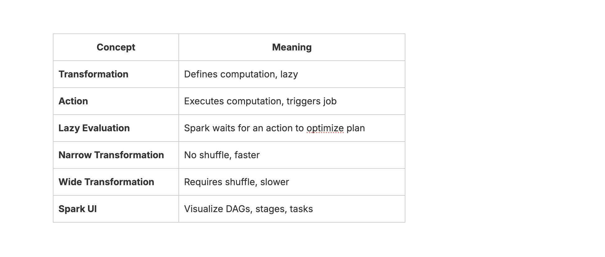

#### Day21: Actions, Transformations & Lazy Evaluation (Deep Dive)
---

#### 1. Transformations vs Actions
**🔹 Transformations (Lazy)**
- Define a new DataFrame from an existing one — but don’t execute immediately.
- Spark only builds a logical plan (DAG) of operations.
- Execution happens later when an action is called.

**Examples:**
``` python
filter(), select(), withColumn(), map(), flatMap(), join(), groupBy()
```
**🔹 Actions (Eager)**
- Trigger execution of the logical plan.
- Spark launches jobs, stages, and tasks.

**Examples:**
``` python
show(), count(), collect(), take(), save(), first(), write.csv()
```
**🧩 Analogy:**

Think of transformations as _writing down the recipe,_

and actions as _actually cooking the dish._

#### 2. Lazy Evaluation in Action
``` python
from pyspark.sql import SparkSession
spark = SparkSession.builder.appName("Day21_LazyEval").getOrCreate()

data = [("Alice", 4000), ("Bob", 6000), ("Cathy", 7000)]
df = spark.createDataFrame(data, ["name", "salary"])

# Transformation only (lazy)
filtered_df = df.filter(df.salary > 5000)
selected_df = filtered_df.select("name")

# Still lazy — no computation yet
print("Nothing has executed yet...")

# Action triggers the plan
selected_df.show()
```
✅ Spark executes only when .show() is called.
 
 You can see this in the Spark UI under “Jobs” (usually at http://localhost:4040).

#### 3. Narrow vs Wide Transformations


Shuffling = Spark redistributes data across executors → expensive operation.

**Example:**
``` bash
# Narrow
df.filter(df.salary > 5000)

# Wide (shuffle)
df.groupBy().avg("salary")
```

💡 Always try to reduce wide transformations or repartition data wisely.

#### 4. Track Execution with Spark UI DAGs
- Run your PySpark script.
- Open your Spark UI (typically at http://localhost:4040).
- Go to:
	- Jobs tab → shows each action.
	- Stages tab → shows DAG stages.
	- SQL tab → shows optimized logical & physical plans.
Observe:
- Each transformation adds a node to the DAG.
- Each action triggers a new job in Spark UI.
#### 5. Small Exercise: filter → groupBy → count
Try this code:
``` python
from pyspark.sql import SparkSession
spark = SparkSession.builder.appName("Filter-Groupby-Count").getOrCreate()

data = [
    ("HR", 4000), ("HR", 4500),
    ("IT", 7000), ("IT", 7200),
    ("Finance", 5000), ("Finance", 5500)
]
df = spark.createDataFrame(data, ["department", "salary"])

# Step 1: Transformations only
filtered = df.filter(df.salary > 4500)   # Narrow
grouped = filtered.groupBy("department") # Wide (shuffle)
agg_df = grouped.count()                 # Still lazy

# Step 2: No action yet
print("No Spark job triggered yet!")

# Step 3: Trigger with an action
agg_df.show()

# Step 4: Trigger again (same lineage)
print("Total rows:", agg_df.count())

print(f"\nhttp://localhost:4040 check for details, Press any key to Exit...")
input()

spark.stop()
```
#### Example  - Employee Salary Analysis
``` python
from pyspark.sql import SparkSession

spark = SparkSession.builder.appName("Salary_Analysis").getOrCreate()

data = [
    ("Alice", "HR", 4000),
    ("Bob", "IT", 6000),
    ("Cathy", "IT", 7500),
    ("David", "Finance", 5000),
    ("Eva", "Finance", 6500)
]

df = spark.createDataFrame(data, ["name", "department", "salary"])

# Transformation 1: Narrow
filtered = df.filter(df.salary > 4500)

# Transformation 2: Narrow
bonus = filtered.withColumn("bonus", filtered.salary * 0.10)

# Transformation 3: Wide (shuffle)
avg_salary = bonus.groupBy("department").avg("salary")

# Action triggers execution
avg_salary.show()

# Another action = another job (recomputes transformations)
print("Number of departments:", avg_salary.count())

print(f"\nhttp://localhost:4040 check for details, Press any key to Exit...")
input()

spark.stop()
```
#### ✅ Summary

