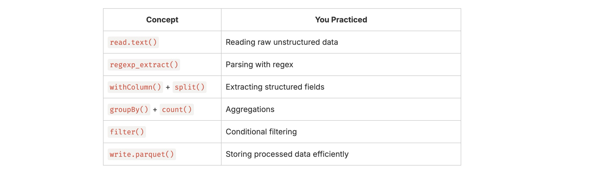

#### 📘 Day23: Log Analysis Project
---
This is your first real-world style mini-project, combining everything you’ve learned so far (reading files, filtering, transformations, and actions).
#### 📁 Sample Data (Log Format)

Each line of the log file typically looks like this (Apache/Nginx combined log):
- Place the sample log file in data/web_access.log, same is available in files directory on GitHub.
#### ✨ Project 1: Overview

We’ll analyse web server logs to extract useful insights like:
- Top URLs accessed
- Status code distribution (e.g., 200, 404, 500)
- Most active IPs
- Errors count

**⚙️ Step 1: Create Spark Session**
``` python
from pyspark.sql import SparkSession

spark = SparkSession.builder.appName("LogAnalysisProject").getOrCreate()

```

**⚙️ Step 2: Read Raw Log File**

We’ll read as a text file (since logs are unstructured).
``` python
logs_df = spark.read.text("data/web_access.log")
logs_df.show(5, truncate=False)

```

**⚙️ Step 3: Parse Log Lines with Regex**

Use regex to extract useful fields — IP, datetime, method, URL, status, and bytes.
``` python
import pyspark.sql.functions as F

log_pattern = r'(\S+) - - \[(.*?)\] "(.*?)" (\d{3}) (\d+)'

logs_parsed_df = logs_df.select(
    F.regexp_extract('value', log_pattern, 1).alias('ip'),
    F.regexp_extract('value', log_pattern, 2).alias('datetime'),
    F.regexp_extract('value', log_pattern, 3).alias('request'),
    F.regexp_extract('value', log_pattern, 4).alias('status'),
    F.regexp_extract('value', log_pattern, 5).alias('bytes')
)
logs_parsed_df.show(5, truncate=False)

```

**⚙️ Step 4: Extract Method and Endpoint**

Split "GET /index.html HTTP/1.1" into method and URL.
``` python
logs_final_df = logs_parsed_df.withColumn("method", F.split("request", " ")[0]) \
                              .withColumn("endpoint", F.split("request", " ")[1]) \
                              .drop("request")

logs_final_df.show(5, truncate=False)
```
**📊 Step 5: Analysis Queries**

🔸 1. Top 10 Accessed URLs
``` python
logs_final_df.groupBy("endpoint").count().orderBy(F.desc("count")).show(10, truncate=False)

```
🔸 2. Status Code Distribution
``` python
logs_final_df.groupBy("status").count().orderBy("status").show()

```
🔸 3. Most Active IPs
``` python
logs_final_df.groupBy("ip").count().orderBy(F.desc("count")).show(10, truncate=False)

```
🔸 4. Count Error Requests (status >= 400)
``` python
count = logs_final_df.filter(F.col("status") >= 400).count()
print(count)

```
🔸 5. Total Bytes Served
``` python
logs_final_df.select(F.sum(F.col("bytes").cast("long")).alias("total_bytes")).show()

```
**💾 Step 6: Save Results**

Save analysis outputs as Parquet (or JSON).
``` python
logs_final_df.write.mode("overwrite").parquet("output/cleaned_logs")

```
**✅ Step 7: (Optional) Convert to TempView for SQL Queries**
``` python
logs_final_df.createOrReplaceTempView("web_logs")

spark.sql("""
    SELECT endpoint, COUNT(*) AS hits
    FROM web_logs
    GROUP BY endpoint
    ORDER BY hits DESC
    LIMIT 10
""").show()
```
#### ✨ Project 2: Log Error Analysis (Top Endpoints & IPs with 404 Errors)

- Top 3 Endpoints Returning 404 Errors
- IPs with Most Errors (status ≥ 400)

Here is the code:
``` python
from pyspark.sql import SparkSession
import pyspark.sql.functions as F

spark = SparkSession.builder.appName("LogErrorAnalysis").getOrCreate()

logs_df = spark.read.text("data/web_access.log")

log_pattern = r'(\S+) - - \[(.*?)\] "(.*?)" (\d{3}) (\d+)'

logs_parsed_df = logs_df.select(
    F.regexp_extract('value', log_pattern, 1).alias('ip'),
    F.regexp_extract('value', log_pattern, 2).alias('datetime'),
    F.regexp_extract('value', log_pattern, 3).alias('request'),
    F.regexp_extract('value', log_pattern, 4).alias('status'),
    F.regexp_extract('value', log_pattern, 5).alias('bytes')
)

logs_final_df = logs_parsed_df.withColumn("method", F.split("request", " ")[0]) \
                              .withColumn("endpoint", F.split("request", " ")[1]) \
                              .drop("request")

# Top 3 Endpoints Returning 404 Errors
top_404_endpoints = (logs_final_df
    .filter(F.col("status") == "404")
    .groupBy("endpoint")
    .count()
    .orderBy(F.desc("count"))
    .limit(3)
)

print("🔹 Top 3 Endpoints Returning 404 Errors:")
top_404_endpoints.show(truncate=False)

# IPs with Most Errors (status ≥ 400)
error_ips = (logs_final_df
    .filter(F.col("status") >= 400)
    .groupBy("ip")
    .count()
    .orderBy(F.desc("count"))
)

print("🔹 IPs with Most Error Responses:")
error_ips.show(truncate=False)

spark.stop()
```
**Output:**
``` bash
🔹 Top 3 Endpoints Returning 404 Errors:
+-----------+-----+
|endpoint   |count|
+-----------+-----+
|/login     |1    |
|/index.html|1    |
+-----------+-----+

🔹 IPs with Most Error Responses:
+-----------+-----+
|ip         |count|
+-----------+-----+
|192.168.1.2|2    |
|172.16.0.5 |1    |
+-----------+-----+
```
Both projects gave you solid practice in regex parsing, transformations, filters, and aggregations on real-world style log data.

#### 🔍 Key Learnings in Day 23
