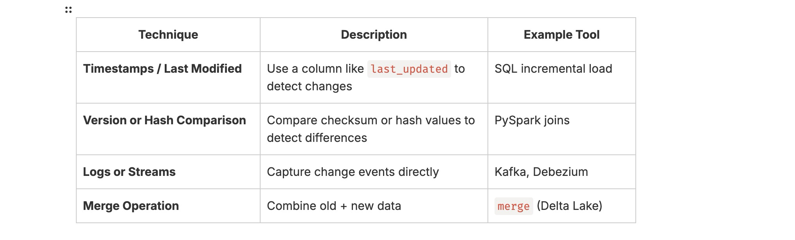

#### 📘 Day28: Change Data Capture (CDC) Pipelines
---
#### 🎯 Goal:
Learn how to detect and process **INSERT, UPDATE, and DELETE** changes from a source system efficiently using PySpark.
#### 🧩 1. What is CDC?
CDC means **tracking and capturing changes** (new, modified, deleted records) from a source table or file, and applying them to a target system like a data warehouse or data lake.

**Example:**

Suppose You have:

Next day, your source changes to:


**CDC identifies:**
- id=2 → UPDATE
- id=3 → INSERT

#### ⚙️ 2. Common CDC Techniques


#### 🧩 3. PySpark CDC Logic (Batch Example)

**Input files:** (use previously mentioned data to create these two files)
- old_data.csv
- new_data.csv

**Create:** _cdc_batch_example.py_
``` python
from pyspark.sql import SparkSession
import pyspark.sql.functions as F

spark = SparkSession.builder.appName("CDCExample").getOrCreate()

# Old data (target)
df_old = spark.read.csv("old_data.csv", header=True, inferSchema=True)

# New data (source)
df_new = spark.read.csv("new_data.csv", header=True, inferSchema=True)

# Join on primary key (id)
df_merge = df_old.alias("old").join(df_new.alias("new"), on="id", how="outer") \
    .select(
        F.coalesce(F.col("new.id"), F.col("old.id")).alias("id"),
        F.coalesce(F.col("new.name"), F.col("old.name")).alias("name"),
        F.coalesce(F.col("new.city"), F.col("old.city")).alias("city"),
        F.when(F.col("old.id").isNull(), "INSERT")
         .when(F.col("new.id").isNull(), "DELETE")
         .when(
             (F.col("old.name") != F.col("new.name")) | 
             (F.col("old.city") != F.col("new.city")),
             "UPDATE"
         )
         .otherwise("NO CHANGE")
         .alias("change_type")
    )

df_merge.show()
```
**Execution:**
``` bash
spark-submit cdc_batch_example.py
```
**Output:**
``` bash
+---+-----+--------+-----------+
| id| name|    city|change_type|
+---+-----+--------+-----------+
|  1| John|   Paris|     UPDATE|
|  2|Alice|New York|     UPDATE|
|  3|  Bob|  Berlin|     INSERT|
+---+-----+--------+-----------+
```
#### 🧩 Exercises
#### ⚙️ Exercise 1:
Implement CDC logic (INSERT/UPDATE/DELETE) for two CSV files (customers_old.csv, customers_new.csv).

_customers_old.csv_
``` bash
id,name,email,city
1,John Doe,john@example.com,New York
2,Alice Smith,alice@example.com,Los Angeles
3,Bob Johnson,bob@example.com,Chicago
4,Emily Davis,emily@example.com,Houston
5,Michael Brown,michael@example.com,San Francisco
```
_customers_new.csv_
``` bash
id,name,email,city
1,John Doe,john_doe@example.com,New York
2,Alice Smith,alice@example.com,Los Angeles
3,Bob Johnson,bob@example.com,Chicago
5,Michael Brown,michael@example.com,San Jose
6,Linda Taylor,linda@example.com,Seattle
```
**Files Location:**
``` bash
/Users/sureshkumar/myspark/week4/cdc/data/customers_old.csv
/Users/sureshkumar/myspark/week4/cdc/data/customers_new.csv
```
**Here is the code:**
``` python
from pyspark.sql import SparkSession
import pyspark.sql.functions as F

spark = SparkSession.builder.appName("Customers_CDC_Example").getOrCreate()

# Old data (target)
df_old = spark.read.csv("file:///Users/sureshkumar/myspark/week4/cdc/data/customers_old.csv", header=True, inferSchema=True)

# New data (source)
df_new = spark.read.csv("file:///Users/sureshkumar/myspark/week4/cdc/data/customers_new.csv", header=True, inferSchema=True)

# Join on primary key (id)
df_merge = df_old.alias("old").join(df_new.alias("new"), on="id", how="outer") \
    .select(
        F.coalesce(F.col("new.id"), F.col("old.id")).alias("id"),
        F.coalesce(F.col("new.name"), F.col("old.name")).alias("name"),
        F.coalesce(F.col("new.email"), F.col("old.email")).alias("email"),
        F.coalesce(F.col("new.city"), F.col("old.city")).alias("city"),
        F.when(F.col("old.id").isNull(), "INSERT")
         .when(F.col("new.id").isNull(), "DELETE")
         .when(
             (F.col("old.name") != F.col("new.name")) | 
             (F.col("old.email") != F.col("new.email")) |
             (F.col("old.city") != F.col("new.city")),
             "UPDATE"
         )
         .otherwise("NO_CHANGE")
         .alias("change_type")
    )

df_merge.show()
```
**Output:**
``` bash
+---+-------------+--------------------+-----------+-----------+
| id|         name|               email|       city|change_type|
+---+-------------+--------------------+-----------+-----------+
|  1|     John Doe|john_doe@example.com|   New York|     UPDATE|
|  2|  Alice Smith|   alice@example.com|Los Angeles|  NO CHANGE|
|  3|  Bob Johnson|     bob@example.com|    Chicago|  NO CHANGE|
|  4|  Emily Davis|   emily@example.com|    Houston|     DELETE|
|  5|Michael Brown| michael@example.com|   San Jose|     UPDATE|
|  6| Linda Taylor|   linda@example.com|    Seattle|     INSERT|
+---+-------------+--------------------+-----------+-----------+
``` 
#### ⚙️ Exercise 2:
Write only changed records (CDC output) to a Parquet file.

**Code:** _customer_cdc_parquet.py_
``` bash
from pyspark.sql import SparkSession
import pyspark.sql.functions as F

spark = SparkSession.builder.appName("Customers_CDC_Parquet_Example").getOrCreate()

# Old data (target)
df_old = spark.read.csv("file:///Users/sureshkumar/myspark/week4/cdc/data/customers_old.csv", header=True, inferSchema=True)

# New data (source)
df_new = spark.read.csv("file:///Users/sureshkumar/myspark/week4/cdc/data/customers_new.csv", header=True, inferSchema=True)

# Join on primary key (id)
df_merge = df_old.alias("old").join(df_new.alias("new"), on="id", how="outer") \
    .select(
        F.coalesce(F.col("new.id"), F.col("old.id")).alias("id"),
        F.coalesce(F.col("new.name"), F.col("old.name")).alias("name"),
        F.coalesce(F.col("new.email"), F.col("old.email")).alias("email"),
        F.coalesce(F.col("new.city"), F.col("old.city")).alias("city"),
        F.when(F.col("old.id").isNull(), "INSERT")
         .when(F.col("new.id").isNull(), "DELETE")
         .when(
             (F.col("old.name") != F.col("new.name")) | 
             (F.col("old.email") != F.col("new.email")) |
             (F.col("old.city") != F.col("new.city")),
             "UPDATE"
         )
         .otherwise("NO_CHANGE")
         .alias("change_type")
    )

# Filter only actual changes
cdc_changes = df_cdc.filter(F.col("change_type") != "NO_CHANGE")

# ------------------------------
# Write changed records to Parquet
# ------------------------------
parquet_path = "file:///Users/sureshkumar/myspark/week4/cdc/customer_parquet/"
cdc_changes.write.mode("overwrite").parquet(parquet_path)

# ------------------------------
# Read Parquet back and show
# ------------------------------
cdc_df = spark.read.parquet(parquet_path)
print("\n✅ CDC Records Written to Parquet:")
cdc_df.show(truncate=False)

# Stop Spark session
spark.stop()
```
**Output:**
``` bash
+---+-------------+--------------------+--------+-----------+
|id |name         |email               |city    |change_type|
+---+-------------+--------------------+--------+-----------+
|1  |John Doe     |john_doe@example.com|New York|UPDATE     |
|4  |Emily Davis  |emily@example.com   |Houston |DELETE     |
|5  |Michael Brown|michael@example.com |San Jose|UPDATE     |
|6  |Linda Taylor |linda@example.com   |Seattle |INSERT     |
+---+-------------+--------------------+--------+-----------+
```
#### ⚡ Observation:

CDC pipelines are incremental by design — you only move what changed, reducing cost and improving performance.

They form the backbone of **ETL refresh, Data Warehouse updates, and Streaming data lakes.**

#### 🌟 Summary:

⚡ You’ve now mastered Change Data Capture (CDC) with PySpark:
 
 **🧩 CDC Fundamentals** - detecting INSERT, UPDATE, and DELETE changes between old and new datasets.
 
 **🔁 Incremental Processing** - filtering and processing only changed records instead of full reloads.
 
 **💾 Parquet Sink for CDC** - writing only changed records to Parquet for efficient downstream processing.
 
 **⚙️ PySpark Join & Conditional Logic** - using full outer joins, coalesce, and when/otherwise to classify changes.
 
 **📊 Pipeline Observation** - CDC enables scalable, incremental, and cost-efficient ETL workflows.