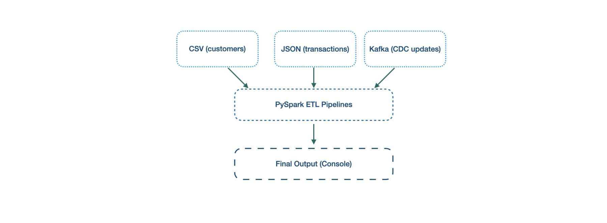

#### 📘 Day30: End-to-End ETL Project (Batch + Incremental + Streaming)
---
#### 🎯 Project Goal:

Build a complete PySpark ETL pipeline that:
1. Extracts data from multiple sources (CSV, JSON, Kafka)
2. Transforms and merges them (joins, filters, aggregates)
3. Loads the result into a target (Console)
4. Demonstrates incremental + streaming updates

#### 🏗️ Architecture:


#### ✅ Prepare All Things Needed:
**File:** *data/batch_customers.csv*
``` text
customer_id,name,country
101,John Doe,USA
102,Jane Smith,UK
103,Ali Khan,India
104,Maria Garcia,Spain
```
**File:** *data/transactions.json*
``` json
{"customer_id":101,"amount":250.0}
{"customer_id":102,"amount":450.5}
{"customer_id":103,"amount":300.0}
{"customer_id":104,"amount":150.0}
```
**File:** *end-to-end-etl-project.py*
``` python
from pyspark.sql import SparkSession
from pyspark.sql.functions import *

spark = SparkSession.builder.appName("EndToEnd_ETL_Project").getOrCreate()

# =========================
# 1️⃣ Batch Sources
# =========================
df_customers = spark.read.csv(
    "file:///Users/sureshkumar/myspark/week4/day30-end-to-end-project/data/batch_customers.csv",
    header=True, inferSchema=True
)

df_transactions = spark.read.json(
    "file:///Users/sureshkumar/myspark/week4/day30-end-to-end-project/data/batch_transactions.json"
)

# Drop duplicate column before join (prevent name collision)
if "amount" in df_customers.columns:
    df_customers = df_customers.drop("amount")

# Join static data (CSV + JSON)
df_joined = (
    df_transactions.alias("txn")
    .join(df_customers.alias("cust"), on="customer_id", how="left")
    .select(
        col("txn.customer_id"),
        col("cust.name"),
        col("cust.country"),
        col("txn.amount").alias("txn_amount")  # rename
    )
)

# =========================
# 2️⃣ Streaming Source (Kafka CDC)
# =========================
schema = "customer_id INT, amount DOUBLE, op STRING"

df_stream = (
    spark.readStream
    .format("kafka")
    .option("kafka.bootstrap.servers", "localhost:9092")
    .option("subscribe", "customers_cdc")
    .load()
    .select(from_json(col("value").cast("string"), schema).alias("data"))
    .select("data.*")
    .withColumnRenamed("amount", "cdc_amount")  # rename early
)

# =========================
# 3️⃣ Combine Batch + Streaming
# =========================
df_combined = (
    df_stream.alias("cdc")
    .join(df_joined.alias("base"), on="customer_id", how="left")
    .select(
        col("cdc.customer_id"),
        col("base.name"),
        col("base.country"),
        col("cdc.op"),
        col("cdc.cdc_amount")
    )
)

# =========================
# 4️⃣ Aggregation
# =========================
df_final = (
    df_combined.groupBy("country", "op")
    .agg(
        sum("cdc_amount").alias("total_amount"),
        count("*").alias("event_count")
    )
)

# =========================
# 5️⃣ Stream Output
# =========================
query = (
    df_final.writeStream
    .outputMode("complete")
    .format("console")
    .option("truncate", "false")
    .trigger(processingTime="15 seconds")
    .start()
)

query.awaitTermination()
```
#### ⚙️ Execution :

**- Start Kafka servers**
``` bash
kafka-server-start /opt/homebrew/etc/kafka/server.properties
```
**- Start producer**
``` bash
kafka-console-producer --topic customers_cdc --bootstrap-server localhost:9092
```
**- Start ETL program:**
``` bash
spark-submit --packages org.apache.spark:spark-sql-kafka-0-10_2.13:4.0.1 end-to-end-etl-project.py
```
**- Post message:**
``` json
{"customer_id":101,"amount":50.0,"op":"update"}
{"customer_id":101,"amount":100.0,"op":"insert"}
{"customer_id":101,"amount":0.0,"op":"delete"}
{"customer_id":104,"amount":100.0,"op":"update"}
{"customer_id":104,"amount":200.0,"op":"update"}
```
**- Output:**
``` bash
-------------------------------------------
Batch: 5
-------------------------------------------
+-------+------+------------+-----------+
|country|op    |total_amount|event_count|
+-------+------+------------+-----------+
|USA    |delete|0.0         |1          |
|USA    |insert|100.0       |1          |
|Spain  |update|300.0       |2          |
|USA    |update|50.0        |1          |
+-------+------+------------+-----------+
```

**🌟 Summary:**

🚀 You’ve now built a complete real-time data pipeline:

- 📥 Extracted data from multiple heterogeneous sources (CSV, JSON, Kafka)

- 🔄 Transformed and joined using PySpark DataFrame APIs

- 🧮 Integrated live CDC events from Kafka for continuous updates

- 🖥️ Produced actionable insights live in console

- 🧱 Combined batch + streaming into a single ETL architecture